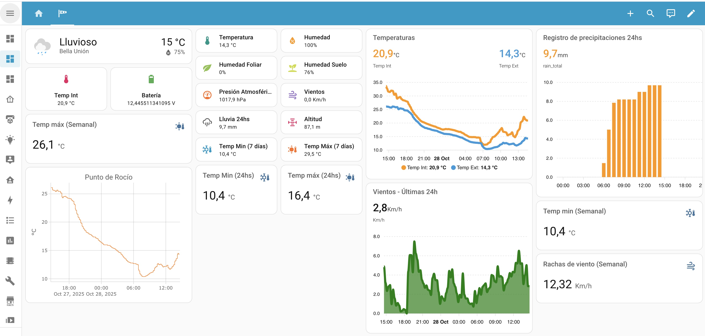

# ESP32 Weather Station for Home Assistant

A reliable, 3D-printed weather station powered by ESP32 and integrated with Home Assistant via ESPHome. **Field tested and validated for over 4 years** in real-world conditions.


<!-- TODO: Agregar foto principal del proyecto -->

## ⭐ Features

- 🌡️ Temperature monitoring (dual sensors)
- 💧 Humidity measurement (air and soil)
- 🌪️ Wind speed tracking
- 🌧️ Rainfall measurement
- 📊 Atmospheric pressure
- 🍃 Leaf wetness detection
- 🔋 Battery monitoring
- 💦 Irrigation control (2 zones)
- 🏠 Full Home Assistant integration via ESPHome
- 📡 Optional MQTT support
- ✅ **4+ years of continuous operation and refinement**

## 📋 Table of Contents

- [Hardware Requirements](#hardware-requirements)
- [Sensors](#sensors)
- [Wiring Diagram](#wiring-diagram)
- [3D Printed Parts](#3d-printed-parts)
- [Installation](#installation)
- [Configuration](#configuration)
- [Calibration](#calibration)
- [Home Assistant Integration](#home-assistant-integration)
- [Lessons Learned](#lessons-learned)
- [Contributing](#contributing)
- [License](#license)

## 🛠️ Hardware Requirements

### Main Components

| Component | Model/Type | Quantity | Notes |
|-----------|------------|----------|-------|
| Microcontroller | ESP32-DevKit | 1 | 
| Temperature/Humidity | DHT22 (AM2302) | 1 | Digital sensor |
| Pressure Sensor | BMP280 | 1 | I2C address: 0x76 |
| Soil Moisture | Decagon 10HS *or* Sonoff MS01 | 1 | Capacitive sensor, budget alternative available |
| Anemometer | HOBO S-WSB-M003 | 1 | Can be replaced with 3D printed version |
| Rain Gauge | 3D Printed | 1 | Tipping bucket type, pulse counter |
| Leaf Wetness | Meter PHYTOS 31 | 1 | Analog sensor |
| Battery | 12V 4.5Ah Gel | 1 | For backup power |
| Solar Panel | 20W | 1 | For continuous operation |
| Solar Charge Controller | 10A | 1 | Protects battery |
| Relay Module | 2-Channel | 1 | For irrigation control |

### Additional Components

- Voltage divider resistors for battery monitoring (see calibration section)
- Wiring and waterproof connectors
- **Power Supply:**
  - Solar Panel: 20W
  - Battery: 12V 4.5Ah Gel battery
  - Solar Charge Controller: 10A
  - Step-down converter (12V to 5V for ESP32)
- Waterproof enclosure/housing (3D printed)
- Cable glands for weatherproofing

### Tools Required

- 3D Printer
- Soldering iron
- Multimeter (for calibration)
- Wire strippers
- <!-- TODO: Otras herramientas -->

**Estimated Total Cost:** 
- **Full version** (with HOBO anemometer & Decagon soil sensor): ~$150-200 USD
- **Budget version** (3D printed anemometer & Sonoff MS01): ~$80-120 USD

## 📡 Sensors

### Pin Configuration

| Sensor | GPIO Pin | Type | Update Interval |
|--------|----------|------|-----------------|
| DHT22 | 23 | Digital | 15 min |
| BMP280 | 21/22 | I2C | 15 min |
| Anemometer | 27 | Pulse Counter | 60 sec |
| Rain Gauge | 33 | Pulse Counter | 60 sec |
| Soil Moisture | 34 | ADC | 10 min |
| Leaf Wetness | 32 | ADC | 15 min |
| Battery Monitor | 35 | ADC | 10 min |
| Irrigation Zone 1 | 14 | Digital Output | - |
| Irrigation Zone 2 | 13 | Digital Output | - |

<!-- TODO: Verificar si hay algún pin adicional -->

## 🔌 Wiring Diagram


<!-- TODO: Crear y agregar diagrama de conexiones -->

**Important Notes:**
- Use appropriate pull-up/pull-down resistors
- Ensure proper voltage levels (3.3V vs 5V)
- Add filtering capacitors near sensors to reduce noise
- <!-- TODO: Otras notas importantes de conexión -->

## 🖨️ 3D Printed Parts

All STL files are available in the [`hardware/3d_models/`](hardware/3d_models/) directory.

**Organization:** Each sensor has its own folder containing:
- STL files for printing
- `img/` subfolder with assembly reference images

This structure helps you see how each component should look when assembled and mounted.

### Parts List

- Main housing/enclosure
- Sensor mounts
- Radiation shield (Stevenson screen style for temperature accuracy)
- **Rain gauge** - Complete tipping bucket mechanism
- **Anemometer** (optional, budget alternative to HOBO sensor)
  - Cup assembly
  - Bearing mount
  - Pulse generator mechanism
- Mounting brackets
- Cable management clips

### Print Settings

- **Layer Height:** 0.2mm
- **Infill:** 20-30%
- **Material:** PETG or ASA (UV and weather resistant)
  - **Critical:** Do NOT use PLA - it degrades quickly outdoors
- **Supports:** Required for overhangs in rain gauge and anemometer parts
- **Post-processing:** 
  - Seal layer lines with epoxy or UV-resistant coating
  - Sand parts that contact moving components (rain gauge, anemometer)
  
### Assembly Notes

- Use stainless steel hardware for outdoor durability
- Apply thread locker on outdoor fasteners
- Ensure proper ventilation in temperature sensor housing
- Test rain gauge calibration after assembly (0.375mm per tip)

## 📥 Installation

### 1. Hardware Assembly

1. Print all 3D parts
2. Solder components according to wiring diagram
3. Assemble weather station housing
4. Mount sensors in appropriate locations
5. Connect ESP32 to power supply

<!-- TODO: Expandir con pasos más detallados -->

### 2. ESPHome Setup

#### Prerequisites

- [ESPHome](https://esphome.io/) installed
- Home Assistant running (optional but recommended)
- USB cable for initial flash

#### Steps

1. Clone this repository:
```bash
git clone https://github.com/YOUR_USERNAME/weather-station-esp32.git
cd weather-station-esp32
```

2. Copy the secrets template:
```bash
cp secrets.yaml.example secrets.yaml
```

3. Edit `secrets.yaml` with your credentials:
```yaml
wifi_ssid: "Your_WiFi_SSID"
wifi_password: "Your_WiFi_Password"
# ... etc
```

4. Adjust `weather_station.yaml` settings:
   - Static IP address (or comment out for DHCP)
   - Device name
   - Calibration values (see [Calibration](#calibration) section)

5. Compile and upload:
```bash
esphome run weather_station.yaml
```

6. After first flash, use OTA updates for future changes

## ⚙️ Configuration

### Static IP vs DHCP

By default, the configuration uses a static IP. To use DHCP instead, comment out the `manual_ip` section:

```yaml
wifi:
  ssid: !secret wifi_ssid
  password: !secret wifi_password
  # manual_ip:
  #   static_ip: 192.168.1.XXX
  #   ...
```

### Update Intervals

Adjust sensor update intervals based on your needs:
- Battery monitoring: 10 minutes (default)
- Temperature/Humidity: 15 minutes (default)
- Wind/Rain: 60 seconds (real-time)

Lower intervals = more frequent updates but higher power consumption.

### MQTT (Optional)

To enable MQTT, uncomment the MQTT section in `weather_station.yaml` and add credentials to `secrets.yaml`.

## 🎯 Calibration

### Soil Moisture Sensor

**Important:** Calibration is sensor-specific and critical for accuracy.

#### For Decagon 10HS (Current configuration):
- Dry (in air): 0.40V = 0%
- Wet (in water): 1.12V = 100%

#### For Sonoff MS01 (Budget alternative):
Calibration values will differ. To calibrate:

1. Place sensor in air (completely dry) and note voltage
2. Place sensor in water (completely saturated) and note voltage
3. Update in YAML:
```yaml
- calibrate_linear:
    - YOUR_DRY_VOLTAGE -> 0
    - YOUR_WET_VOLTAGE -> 100
```

**To check voltage readings:**
```bash
esphome logs weather_station.yaml
```

### Wind Speed (Anemometer)

#### HOBO S-WSB-M003 (recommended):
- Current calibration: 0.0111156 × 3.6 (converts to km/h)
- Professional-grade sensor with proven accuracy

#### 3D Printed Alternative (budget option):
- Requires calibration against known wind speed or reference anemometer
- Factor may vary based on cup size and bearing friction
- Start with same calibration factor and adjust based on testing

**Calibration process:**
1. Compare readings with local weather station
2. Adjust multiplier factor in YAML if needed

### Rain Gauge (3D Printed)

- **Current calibration:** 0.375mm per tip
- **Type:** Tipping bucket with pulse counter
- Design based on standard rain gauge geometry

**To verify calibration:**
1. Pour a known volume of water (e.g., 10ml)
2. Count the number of tips
3. Calculate: mm of rain = volume (ml) / collection area (cm²)
4. Adjust multiplier in YAML if needed

**Note:** The 3D printed design STL includes the collection funnel with specific diameter for 0.375mm/tip calibration.

### Battery Monitor

Voltage divider ratio: 7.3037037

**To calibrate:**
1. Measure actual battery voltage with multimeter
2. Compare with sensor reading
3. Adjust multiplier: `new_multiplier = (actual_voltage / sensor_reading) * current_multiplier`

## 🏠 Home Assistant Integration

### Automatic Discovery

Once ESPHome device is running, it will automatically appear in Home Assistant:

1. Go to **Settings** → **Devices & Services**
2. ESPHome integration should show your weather station
3. Click **Configure** and enter API encryption key

### Creating Dashboards

Example Lovelace card configuration:

```
type: horizontal-stack
cards:
  - type: tile
    entity: sensor.temperatura
    vertical: false
    color: teal
    features_position: bottom
    name: Temperatura
    show_entity_picture: true
  - type: tile
    entity: sensor.humedad
    vertical: false
    color: orange
    features_position: bottom
    name: Humedad
    show_entity_picture: true

```

### Automations

Example automation for irrigation based on soil moisture:

```
   alias: Riego jardín ON
description: Encendido de riego diario
triggers:
  - at: "19:00:00"
    trigger: time
  - at: "06:00:00"
    trigger: time
conditions:
  - condition: numeric_state
    entity_id: sensor.humsuelo_3
    below: 50
actions:
  - action: switch.turn_on
    metadata: {}
    data: {}
    target:
      entity_id: switch.riego_jardin
  - data:
      message: Encendido programado.
      title: "Sistema de riego:"
    action: notify.mobile_app_1
  - data:
      message: Encendido programado.
      title: "Sistema de riego:"
    action: notify.mobile_app_2
mode: single

```

## 📊 Lessons Learned (4+ Years of Operation)

### What Worked Well

- Sensor reliability
- Weather resistance of enclosure
- Battery life
- etc.

### Challenges Overcome

- Initial calibration issues
- Weather-related failures
- Improvements made over time
- etc.

### Recommendations

- Use PETG or ASA for outdoor parts
- Add proper ventilation but protect from rain
- Regular maintenance schedule
- etc.

### Design Evolution

- Version 1.0: Initial design
- Version 2.0: Improvements based on first year
- Current version: Refined after 4 years
- etc.

## ❤️ Contributing

Contributions are welcome! If you'd like to help, please feel free to submit a pull request or open an issue to discuss a new feature or bug.

**Ways to contribute:**
- 🐛 Report bugs or issues you encounter
- 💡 Suggest new features or improvements
- 📝 Improve documentation
- 🔧 Submit fixes or enhancements
- 📸 Share photos of your build
- 🧪 Share calibration data for different sensors

**Before contributing:**
- Check existing issues to avoid duplicates
- For major changes, open an issue first to discuss
- Follow the existing code style in YAML files
- Test your changes with ESPHome before submitting

## 📝 TODO / Future Improvements

- [ ] <!-- TODO: Lista de mejoras futuras -->
- [ ] Add UV sensor
- [ ] Solar panel integration
- [ ] Wind direction sensor
- [ ] etc.

## 📄 License

This project is licensed under the MIT License - see the [LICENSE](LICENSE) file for details.

Alternatively, you can choose:
- GPL-3.0 (if you want derivatives to be open source)
- CC BY-SA 4.0 (for hardware/documentation)
- Apache 2.0

## 🙏 Acknowledgments

- ESPHome community
- Home Assistant community
- ESP32 community
---

**Note:** This project has been tested and refined over 4+ years of continuous outdoor operation. While the design is proven, always consider your local climate and conditions when replicating.

## 🖼️ Gallery

General project images are available in [`docs/images/`](docs/images/).

### Overview

*Complete weather station installation*

### Installation

*Mounted and operational*

### Home Assistant Dashboard

*Main weather dashboard*


*Detailed sensor readings*

**Note:** Each sensor folder in `hardware/3d_models/` contains specific assembly images.
